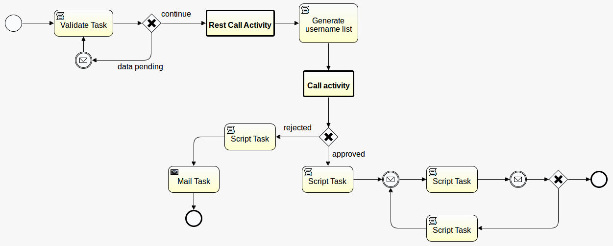
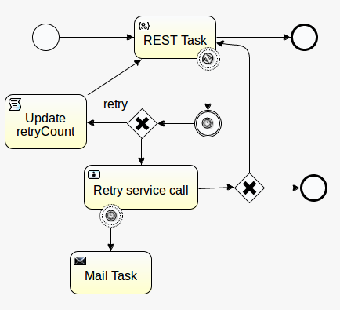
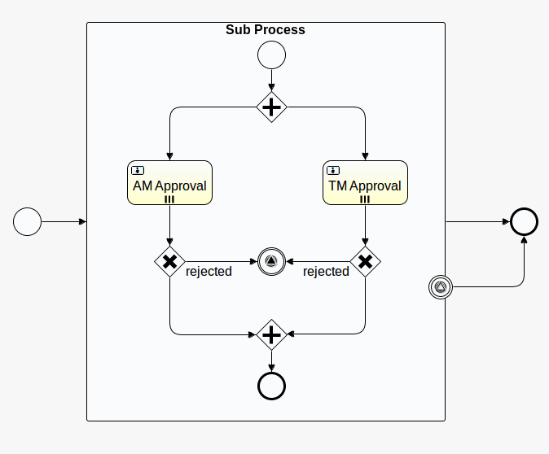

# BPS BPMN complex workflow setup
This docker setup demonstrate most of the commonly used features in BPS BPMN language. The demo setup covers follwoing aspects. 
* BPMN workflow ochestrations using different gateways. 
* Calling an external REST service (MSF4J Service) from BPMN.
* Creating sub processes in BPMN. 
* Linking two or more BPMN diagrams using Call activity.
* BPMN correlation using message listeners.
* BPMN signaling events.
* BPMN user task.
* BPMN mail tasks.
* BPMN scripting task.
* BPMN process error handling. 
* BPMN multi instance capabilities.

## Versions
* [**v1.0.0**](v1.0.0) - Setup using MySQL v5.6, wso2-ie-6.1.1
  * Documentations: [Business Process Management](https://docs.wso2.com/display/EI611/Business+Process+Management).

## How to run
1. Install docker into your setup environment.
2. Clone this Git repository. If you only need to download this demo scenario follow [this blog](http://amalg-blogs.blogspot.com/2017/12/github-clone-only-sub-directory-of.html).
3. Depending on the demo verison you choose to run, download the desired **wso2ei-x.x.x.zip** WUM updated zip file.
4. Copy the **wso2ei-x.x.x.zip** file into **presales-demos/bps-bpmn-complex-workflow/vX.X.X/bps-setup/** location.
6. Go to **presales-demos/bps-bpmn-complex-workflow/vX.X.X/** location and run the following commands.
    ```bash
    ## Below command will build and run the full setup.
    docker-compose up
    ```
    **Optional**  
    If you need to start the services as background processes execute the following command.
    ```bash
    docker-compose up -d
    ```
    If you need to build the images individually you can execute the commands in-order as following.
    ```bash
    docker-compose build mysql-service
    docker-compose build msf4j-service
    docker-compose build bps-service
    ```
    To run the services individually you can execute the commands in-order as following.
    ```bash
    docker-compose up mysql-service
    docker-compose up msf4j-service
    docker-compose up bps-service
    ```
7. To stop the services execute the following command. 
    ```bash
    docker-compose down
    ```
## Setup 
* Main workflow.


* Service call template workflow.


* Approval process workflow.

